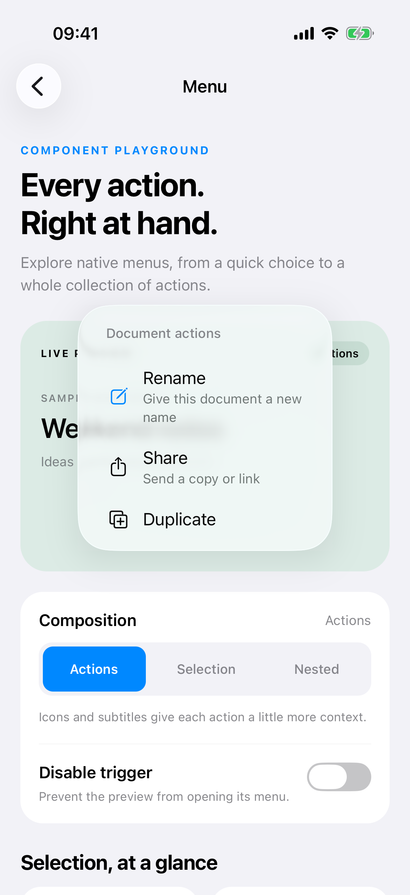
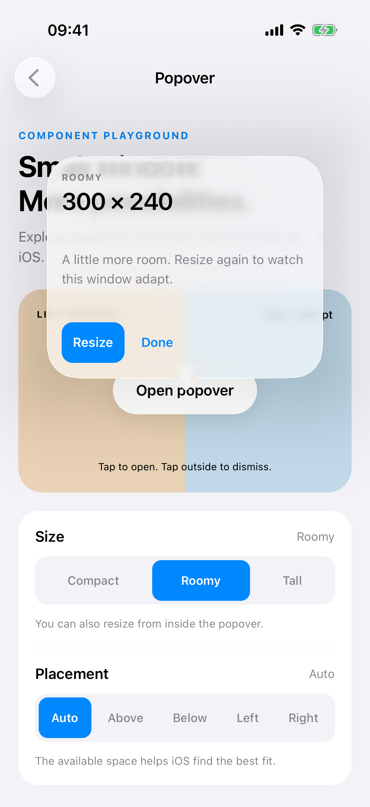
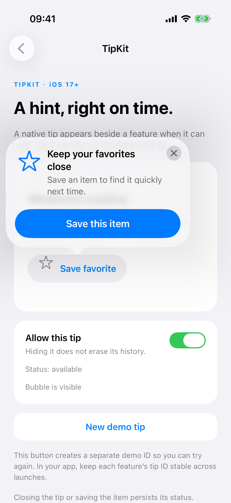
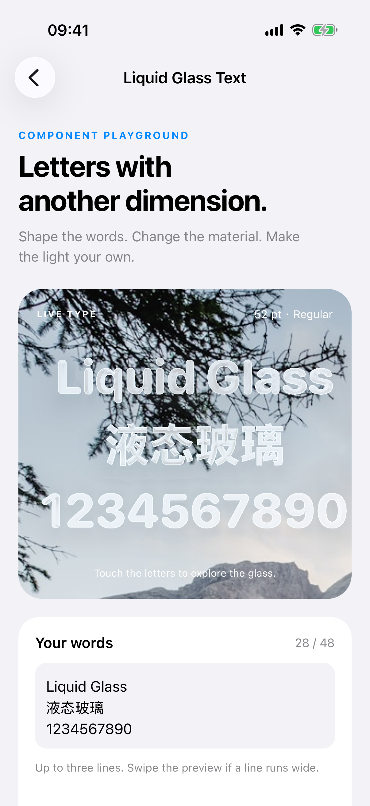
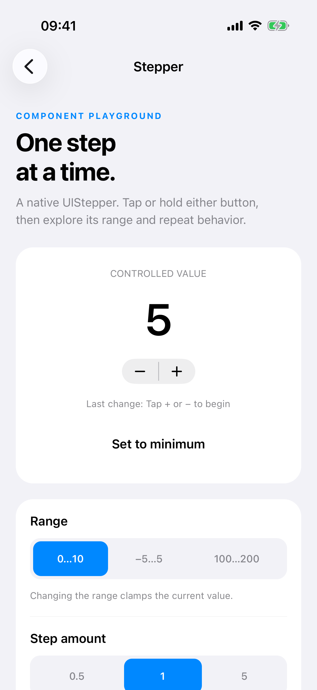
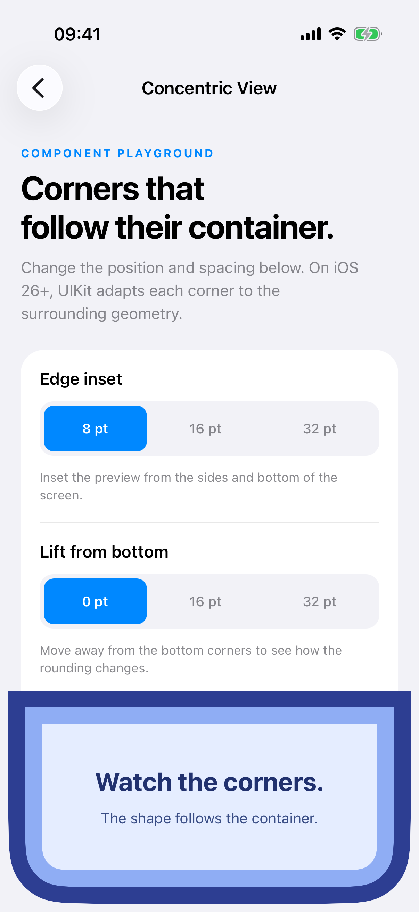
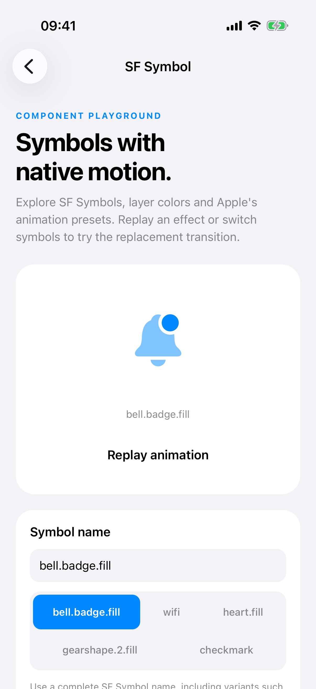

# react-native-tinyui

A dependency-free collection of native iOS components for React Native's New
Architecture. Built on Fabric, TinyUI offers familiar React composition while
staying close to native APIs. It uses UIKit by default and SwiftUI where needed.

## Components

| Component                          | What it does                                                   |
| ---------------------------------- | -------------------------------------------------------------- |
| [Menu](#menu)                      | Present native menus with actions, submenus, and sections       |
| [Popover](#popover)                | Show interactive React Native content in a native popover      |
| [TipKit](#tipkit)                  | Present contextual tips using Apple's TipKit framework         |
| [LiquidGlassText](#liquidglasstext) | Render text with native glass effects inside the glyphs        |
| [Stepper](#stepper)                | Adjust numeric values with the native iOS stepper              |
| [ConcentricView](#concentricview)  | Follow the containing view's corners with concentric rounding   |
| [SFSymbol](#sfsymbol)              | Display SF Symbols with native rendering and animation effects |

Screenshots below show the example app on an iPhone 17 Pro simulator running
iOS 26.5.

## Philosophy and comparison with `@expo/ui`

TinyUI prioritizes performance, stability, a small app footprint, and familiar
React composition. These priorities guide which components we add and how we
bridge them.

| Design choice | `react-native-tinyui` | `@expo/ui` |
| --- | --- | --- |
| Runtime dependencies | Zero additional runtime dependencies beyond `react` and `react-native`. No `expo`, Expo Modules, or `react-native-nitro-modules` required. | Uses Expo Modules; existing React Native apps must [install `expo`](https://docs.expo.dev/versions/latest/sdk/ui/swift-ui/#installation). |
| Native implementation | Performance and stability first. Prefers direct UIKit integration through Fabric; uses SwiftUI when a component needs it. | Uses [SwiftUI on iOS](https://docs.expo.dev/versions/latest/sdk/ui/swift-ui/), with its layout and hosting model. |
| Selective inclusion and app size | Component-specific JS imports avoid loading unrelated component modules. An explicit native component list excludes unselected UI implementations and their framework requirements from the pod. | Provides platform-specific JS entry points. Its [iOS podspec](https://github.com/expo/expo/blob/main/packages/expo-ui/ios/ExpoUI.podspec) includes native sources together, without a per-component selection list. JS imports alone do not select native sources. |
| Component scope | Welcomes both system UI and third-party UI, such as [GlassText](#liquidglasstext). Adding components to the catalog does not require apps to include their UI implementations when they remain unselected. | Centers on SwiftUI and Jetpack Compose. Supports [custom SwiftUI components and modifiers, including third-party SwiftUI libraries](https://docs.expo.dev/guides/expo-ui-swift-ui/extending/). |
| React API | Familiar props, children, and controlled/uncontrolled state, composed with ordinary React Native views. Names and behavior stay close to the underlying native APIs. | Exposes native toolkit concepts through React, including SwiftUI views, modifiers, and a [`Host` container](https://docs.expo.dev/versions/latest/sdk/ui/swift-ui/#usage). |
| Supported targets and maintenance | iOS 17+ and the New Architecture only. Excluding older iOS versions and the legacy bridge reduces compatibility code and keeps maintenance focused. | Covers a broader platform scope: SwiftUI on iOS, Jetpack Compose on Android, and [universal components for iOS, Android, and web](https://docs.expo.dev/versions/latest/sdk/ui/universal/). Requirements depend on the Expo SDK and component. |

For the smallest builds, combine component-specific JS imports with
[`react-native-tinyui.components`](#optional-component-selection). All native
components are enabled by default, so configure that list explicitly. Shared
core code, Fabric Codegen, and lightweight registration stubs remain in the
native build; the size savings come from excluding unused UI implementations.
Final bundle size also depends on the app's bundler and linker settings.

## Requirements

- React Native with the New Architecture enabled
- iOS 17 or newer
- `react` and `react-native` are the only peer dependencies

This package intentionally ships only iOS native code. Android and web are not
supported targets.

## Installation

```sh
npm install react-native-tinyui
cd ios && pod install
```

### Optional component selection

To reduce the native code compiled into your app, list only the components you
use in your app's `package.json`:

```json
{
  "react-native-tinyui": {
    "components": ["Menu"]
  }
}
```

Available components:

- `Menu`
- `Popover`
- `LiquidGlassText`
- `Stepper`
- `ConcentricView`
- `SFSymbol`
- `TipKit` (enables `TipKit.Popover`, `TipKit.configure` and `TipKit.invalidate`)

All components are enabled by default. Use an empty `components` array to
compile only the TurboModule core. Run `pod install` again whenever this list
changes. Rendering a component whose native part was not selected throws an
error that names the missing component.

Component-specific JavaScript entry points are also available:

```tsx
import { Menu } from 'react-native-tinyui/menu';
import { Popover } from 'react-native-tinyui/popover';
import { LiquidGlassText } from 'react-native-tinyui/liquid-glass-text';
import { Stepper } from 'react-native-tinyui/stepper';
import { ConcentricView } from 'react-native-tinyui/concentric-view';
import { SFSymbol } from 'react-native-tinyui/sf-symbol';
import { TipKit } from 'react-native-tinyui/tip-kit';
```

The root `react-native-tinyui` imports remain supported for backwards
compatibility. JavaScript entry points provide cleaner dependency boundaries;
`react-native-tinyui.components` controls which native source files are compiled.

## Menu



`Menu` uses `children` as its trigger and receives its native menu entries
through the `options` prop. A tap opens the native menu; `onActionPress`
receives every selected action's stable id and displayed title.

```tsx
import { Menu } from 'react-native-tinyui';

<Menu
  accessibilityLabel="Document actions"
  title="Document actions"
  onActionPress={({ nativeEvent }) => {
    if (nativeEvent.id === 'rename') rename();
    if (nativeEvent.id === 'toggle-pinned') togglePinned();
    if (nativeEvent.id === 'copy-link') copyLink();
    if (nativeEvent.id === 'invite-people') invitePeople();
    if (nativeEvent.id === 'remove') remove();
  }}
  options={[
    {
      id: 'rename',
      title: 'Rename',
      systemImage: 'square.and.pencil',
    },
    {
      id: 'toggle-pinned',
      title: 'Pinned',
      state: 'on',
      systemImage: 'pin',
    },
    {
      type: 'submenu',
      title: 'Share',
      systemImage: 'square.and.arrow.up',
      options: [
        { id: 'copy-link', title: 'Copy link' },
        { id: 'invite-people', title: 'Invite people' },
      ],
    },
    { type: 'divider' },
    {
      id: 'remove',
      title: 'Delete',
      destructive: true,
      systemImage: 'trash',
    },
  ]}
>
  <View style={styles.button}>
    <Text>Actions</Text>
  </View>
</Menu>;
```

Actions are the default option type. Use `type: 'submenu'`, `type: 'section'`,
or `type: 'divider'` for structural entries; nested entries use their own
`options` array. SF Symbols are passed with `systemImage`; missing symbols
simply render no image.

To open the menu from another control, call `open()` on its ref:

```tsx
import { useRef } from 'react';
import { Button, Text } from 'react-native';
import { Menu, type MenuRef } from 'react-native-tinyui/menu';

function DocumentMenu() {
  const menuRef = useRef<MenuRef>(null);

  return (
    <>
      <Menu ref={menuRef} options={[{ id: 'rename', title: 'Rename' }]}>
        <Text>Document actions</Text>
      </Menu>
      <Button title="Open menu" onPress={() => menuRef.current?.open()} />
    </>
  );
}
```

`open()` requires iOS 17.4 or newer and anchors the menu to its mounted trigger.
It does nothing on older iOS versions, while `disabled`, or when the trigger is
detached. Tapping the trigger still works on all supported iOS versions. The ref
also retains the outer View's methods, such as `measure` and `measureInWindow`.

Action options support `subtitle`, `state`, `destructive`, `disabled`, `hidden`,
and `keepOpen`. Set explicit `id` values when handling `onActionPress`; actions
without one receive a generated menu-path id. Use `icon` to load an image from
the containing app's asset catalog; `iconColor` tints either an asset image or
an SF Symbol and accepts React Native `ColorValue`s, including dynamic and
semantic iOS colors. UIKit doesn't expose custom menu title colors, so the
deprecated `titleColor` field is retained only for source compatibility; use
`destructive` for system red styling. Submenus support the same label fields
plus `destructive`, `disabled`, `hidden`, and `displayInline`.

## Popover



`Popover` supports standard controlled and uncontrolled React state. Its content
remains a normal interactive React Native view tree hosted by a real
`UIPopoverPresentationController`.

```tsx
import { Popover, PopoverClose } from 'react-native-tinyui';

<Popover
  defaultOpen={false}
  attachmentAnchor="bottom"
  arrowEdge="top"
  onOpenChange={(open) => console.log({ open })}
  content={({ close }) => (
    <View style={{ width: 280, padding: 20 }}>
      <Text>Any React Native content can be rendered here.</Text>
      <PopoverClose close={close} style={styles.doneButton}>
        <Text>Done</Text>
      </PopoverClose>
    </View>
  )}
>
  <View style={styles.button}>
    <Text>Show details</Text>
  </View>
</Popover>;
```

The trigger is `children` — tapping it opens the popover. The popover body is
the `content` prop, which can be a node or a render function receiving
`{ close }` to dismiss the popover from within. `PopoverClose` (also available
as `Popover.Close`) renders a `Pressable` that calls `close` when pressed.

Use `open` with `onOpenChange` for a controlled popover, or `defaultOpen` for an
uncontrolled one. The layout of `content` determines the popover's preferred
size: set `width` and optionally `height` on its root view, or let its children
determine the height. Size changes are applied while the popover is visible.
UIKit may limit the displayed size to the available space on screen.

Keep the content background transparent to show the native popover material:
Liquid Glass on iOS 26+ when built with Xcode 26+, and the system popover
appearance on earlier iOS versions. `style` on `Popover` styles the trigger's
outer container, not the presented content.

## TipKit



`TipKit.Popover` anchors a native TipKit `TipUIPopoverViewController` to ordinary
React Native children on iOS 17+. The children retain their own touch handlers;
the tip appears automatically when both `enabled` and TipKit's eligibility allow
it. Its text, SF Symbol, action buttons, display history and invalidation use
Apple's TipKit framework. No additional package is required.

Configure TipKit once, **before mounting tips** (for example, during app startup):

```tsx
import { TipKit, SFSymbol } from 'react-native-tinyui';
import { Pressable } from 'react-native';

await TipKit.configure({ displayFrequency: 'daily' });

// Inside your screen:
<TipKit.Popover
  tipId="favorite-feature-v1"
  title="Keep your favorites close"
  message="Save an item to find it quickly next time."
  systemImage="star"
  enabled={isScreenFocused && !hasFavorites}
  maxDisplayCount={3}
  actions={[{ id: 'learn-more', title: 'Learn more' }]}
  onActionPress={({ id }) => {
    if (id === 'learn-more') openHelp();
  }}
  onStatusChange={(status) => console.log(status)}
  onVisibleChange={(visible) => console.log({ visible })}
  onError={(error) => console.warn(error.message)}
>
  <Pressable onPress={async () => {
    await saveFavorite();
    await TipKit.invalidate('favorite-feature-v1', 'actionPerformed');
  }}>
    <SFSymbol name="star" size={24} />
  </Pressable>
</TipKit.Popover>;
```

| Prop | Description | Default |
| --- | --- | --- |
| `tipId` | Required stable identity for persistent history | — |
| `title` | Required nonempty title, already localized by the app | — |
| `message` | Supporting plain text | — |
| `systemImage` | SF Symbol name | — |
| `actions` | Buttons with unique nonempty `{ id, title }` values | `[]` |
| `enabled` | Allows presentation; does not override TipKit eligibility | `true` |
| `maxDisplayCount` | Positive integer; automatically invalidates after this many displays | Unlimited |
| `ignoresDisplayFrequency` | Exempts this tip from the app-wide display interval | `false` |
| `arrowEdge` | Preferred bubble edge: `top`, `bottom`, `leading`, `trailing`, `auto` | `auto` |
| `onStatusChange` | `{ status: 'pending' \| 'available' }` or `{ status: 'invalidated', reason }` | — |
| `onVisibleChange` | Whether the native bubble is actually visible | — |
| `onActionPress` | Receives the selected `{ id, title }`; does not automatically invalidate | — |
| `onError` | Receives `{ code, message }`; otherwise a warning is logged | — |

The component accepts standard `ViewProps` and a native view ref. `style` lays
out the anchor, not the bubble. UIKit chooses the bubble's size and may adapt
the arrow to available space; leading/trailing follow layout direction. Bubble
content is native text/images/actions; `children` supplies only the anchor.
Content edits apply to the next presentation; the currently visible bubble
retains the content and action labels it was presented with.

### Configuration and lifetime

`TipKit.configure({ displayFrequency })` returns a promise. Supported frequencies
are `immediate`, `hourly`, `daily` (default), `weekly` and `monthly`. This is an
app-wide TipKit setting. Repeating the same configuration is safe, including
after Fast Refresh; changing it later rejects with `E_TIPS_ALREADY_CONFIGURED`.
Coordinate this startup configuration with any other native TipKit integration.
Initialization errors reject the promise; an enabled view mounted too early
reports `E_TIPS_NOT_CONFIGURED` and can recover after configuration succeeds.

`TipKit.invalidate(tipId, reason = 'actionPerformed')` also returns a promise and
requires configuration first. It persistently invalidates the ID even when no
view for that tip is mounted. `reason` may be `actionPerformed` or `tipClosed`.
System invalidations can additionally report `displayCountExceeded`,
`displayDurationExceeded`, or `unknown` through `onStatusChange`.

Keep IDs stable across renders, app launches and translations. All instances
with the same ID share their TipKit history. Keep `maxDisplayCount` and
`ignoresDisplayFrequency` consistent for each ID; conflicting values report
`E_CONFLICTING_TIP_OPTIONS`. Use a deliberate new versioned ID for a new feature
tip. Hiding a tip, unmounting it or reconfiguring TinyUI never resets history.

Use `enabled={isScreenFocused && businessCondition}` with your navigation
library. TinyUI also waits for a visible anchor and a free presenter, and
dismisses on detachment or when the anchor leaves the visible area. It presents
at most one TinyUI tip at a time and waits while another modal occupies the
presenter. An outside dismissal suppresses immediate reopening for that mount;
toggle `enabled` off and on to allow another attempt, subject to TipKit's state.
The system close button can permanently invalidate a tip.

This first version exposes popover tips and JS eligibility conditions. Inline
`TipUIView`, native rule/event builders, TipGroup and datastore reset APIs are
not exposed. The example's **New demo tip** button deliberately creates another
ID for trying the behavior again without clearing the app's TipKit datastore.

## LiquidGlassText



`LiquidGlassText` renders native glass inside the glyph outlines, based on
[GlassText](https://github.com/ailtonvivaz/GlassText). It exposes the effect and
typography through React props.
Background image loading is not part of this component.

Building this component requires **Xcode 26+**. Glass is rendered on **iOS 26+**;
on iOS 17–25 it displays ordinary SwiftUI text using the same font, alignment
and optional tint. The rest of TinyUI continues to support iOS 17+.

```tsx
import { LiquidGlassText } from 'react-native-tinyui';

<LiquidGlassText
  text="Liquid Glass"
  effect="regular"
  tint="#00BBDD"
  interactive
  fontDesign="rounded"
  textStyle={{ fontSize: 48, fontWeight: '700' }}
/>;

<LiquidGlassText
  text={'Multi-line\nGlass Text\nEffect'}
  fontDesign="serif"
  textStyle={{ fontSize: 34, fontWeight: '800' }}
  multilineTextAlignment="center"
/>;
```

| Prop                     | Values                                           | Default   |
| ------------------------ | ------------------------------------------------ | --------- |
| `text`                   | String (including text translated in JavaScript) | Required  |
| `effect`                 | `clear`, `regular`, `identity`                   | `clear`   |
| `tint`                   | React Native `ColorValue`                        | —         |
| `interactive`            | Whether the glass responds to interaction        | `false`   |
| `fontDesign`             | `default`, `serif`, `monospaced`, `rounded`      | `default` |
| `textStyle`              | Supported React Native text properties           | —         |
| `multilineTextAlignment` | `leading`, `center`, `trailing`                  | `leading` |

`textStyle` accepts arrays and `StyleSheet.create` references. Explicit
`multilineTextAlignment` overrides `textStyle.textAlign`. `textStyle.color`
supplies the glass tint and fallback text color; an explicit `tint` takes
precedence. `fontFamily` accepts the PostScript name of a font installed in the
app, and `fontDesign` only applies to system fonts.

`tint` accepts a React Native `ColorValue`, including `PlatformColor` and
`DynamicColorIOS`. `identity` applies no glass effect.
The component also accepts standard `ViewProps`, including `style`, `testID`,
accessibility props and a native view ref. The supplied text is used for
the default accessibility label; pass `accessibilityLabel` to override it.

Fabric measures the native text during layout and supplies its default width and
height without a JavaScript measurement pass. Layout styles can override these
dimensions, but do not resize the font or wrap text. As in GlassText, use
explicit `\n` characters for multiple lines. Keep padding on a surrounding
`View`. Color emoji and other glyphs without vector outlines cannot produce a
glass shape.

`text` accepts a string. Applications using JavaScript localization can pass
their translated string directly.

The adapted Core Text outline implementation retains the upstream MIT notice in
[`ios/LiquidGlassText/GlassText-LICENSE`](ios/LiquidGlassText/GlassText-LICENSE).

## Stepper



`Stepper` bridges UIKit's
[`UIStepper`](https://developer.apple.com/documentation/uikit/uistepper) through
Fabric. It supports fractional steps, press-and-hold repeat, and wrapping at
the bounds on iOS 17+.

```tsx
import { useState } from 'react';
import { Stepper } from 'react-native-tinyui';

function Quantity() {
  const [quantity, setQuantity] = useState(1);
  return (
    <Stepper
      accessibilityLabel="Quantity"
      value={quantity}
      minimumValue={1}
      maximumValue={10}
      onValueChange={setQuantity}
    />
  );
}

// Uncontrolled: UIKit owns the value after initialization.
<Stepper defaultValue={2.5} stepValue={0.5} maximumValue={5} wraps />;
```

| Prop | Description | Default |
| --- | --- | --- |
| `value` | Controlled numeric value | — |
| `defaultValue` | Initial value when uncontrolled; later changes are ignored | `0` |
| `minimumValue` | Lower bound | `0` |
| `maximumValue` | Upper bound, at least `minimumValue` | `100` |
| `stepValue` | Positive increment/decrement amount | `1` |
| `isContinuous` | Report changes during interaction; otherwise report on release | `true` |
| `autorepeat` | Repeatedly step while holding a button | `true` |
| `wraps` | Continue from the opposite bound when stepping past an end | `false` |
| `disabled` | Prevent user interaction | `false` |
| `onValueChange` | Callback receiving the new number after user interaction | — |

When `value` is supplied, update it in `onValueChange` to accept changes. Keeping
the same `value` restores the native control to that value. Omit `value` to let
UIKit manage the state. Programmatic value or range changes do not call
`onValueChange`.

All numeric props must be finite, `stepValue` must be positive, and
`maximumValue` must be at least `minimumValue`; invalid inputs throw a descriptive
error. Values are clamped to the current range. Equal bounds produce a fixed
value. Changing an uncontrolled range also clamps its current native value.

The component accepts standard `ViewProps` (except `children`) and a native view
ref. Native accessibility behavior is preserved; use `accessibilityLabel` to
name the value being adjusted. Fabric measures the native control's intrinsic
size. A larger `style` frame centers the native control without stretching
its buttons. Put padding on a surrounding `View`. Like UIKit's control, the
stepper shows the minus and plus buttons; render a separate `Text` for the value.

## ConcentricView



`ConcentricView` is a Fabric container that lets UIKit resolve its corner radii
relative to its containing view. On iOS 26+, it applies
[`UICornerRadius.containerConcentricRadius`](https://developer.apple.com/documentation/uikit/uicornerradius-c.class/containerconcentricradius)
through `UIView.cornerConfiguration`. UIKit handles geometry and layout changes.
Building this component requires **Xcode 26+**; on iOS 17–25 it uses
`minimumRadius` as a fixed corner radius.

```tsx
import { Text } from 'react-native';
import { ConcentricView } from 'react-native-tinyui';

<ConcentricView
  minimumRadius={32}
  style={{ padding: 12, backgroundColor: '#DCEBFF' }}
>
  <ConcentricView
    minimumRadius={12}
    style={{ padding: 20, backgroundColor: '#3875D5' }}
  >
    <Text>UIKit resolves each corner.</Text>
  </ConcentricView>
</ConcentricView>;
```

`minimumRadius` defaults to `0` and must be finite and nonnegative. It only
controls the fixed fallback radius before iOS 26; iOS 26+ resolves corners
entirely through UIKit, without a minimum radius. The component accepts
`children`, standard `ViewProps`, and a native view ref. It clips content
by default; use `style={{ overflow: 'visible' }}` to allow overflow. Avoid
`style.borderRadius` and individual corner radii on this component.
React Native's custom border, outline, and shadow drawing does not calculate
concentric radii; keep those decorations on a surrounding view when needed.

## SFSymbol



`SFSymbol` uses **UIKit `UIImageView` + Apple's Symbols framework**, exposed
through Fabric. It does not embed a SwiftUI hosting view. Xcode 26+ is required
to build; the deployment target remains iOS 17. Yoga measures the configured
symbol's natural size, so `style.width` and `style.height` are optional.

```tsx
import { useState } from 'react';
import { Button, PlatformColor, View } from 'react-native';
import { SFSymbol } from 'react-native-tinyui';

function Favorite() {
  const [selected, setSelected] = useState(false);
  const [trigger, setTrigger] = useState(0);
  return (
    <View>
      <SFSymbol
        name={selected ? 'heart.fill' : 'heart'}
        size={32}
        weight="semibold"
        renderingMode="hierarchical"
        color={PlatformColor('systemPinkColor')}
        effect={{ type: 'bounce', trigger, options: { repeat: false } }}
        contentTransition={{ type: 'magicReplace', direction: 'downUp' }}
      />
      <Button title="Favorite" onPress={() => {
        setSelected(!selected);
        setTrigger(trigger + 1);
      }} />
    </View>
  );
}
```

### Image configuration

| Prop | Values / behavior |
| --- | --- |
| `name` | Required complete symbol name, including variants such as `square.fill`. Missing symbols render empty. |
| `source` | `system` (default), or `asset` for a custom SF Symbol in the app's asset catalog. Ordinary bitmap assets are not accepted. |
| `size` | Positive point size; default `17`. |
| `weight` | `unspecified` (default), `ultraLight`, `thin`, `light`, `regular`, `medium`, `semibold`, `bold`, `heavy`, `black`. |
| `scale` | `default`, `unspecified`, `small`, `medium`, `large`. |
| `textStyle` | `extraLargeTitle`, `extraLargeTitle2`, `largeTitle`, `title1`–`title3`, `headline`, `subheadline`, `body`, `callout`, `footnote`, `caption1`, `caption2`. Overrides `size` and supplies the style's weight unless explicitly set. |
| `fontFamily` | Font/PostScript name used to derive symbol metrics; unknown fonts use system metrics. |
| `allowFontScaling` | Default `true`. Scales the base point size by React Native's `fontScale`, including when using `textStyle`. |
| `maxFontSizeMultiplier` | Cap on that scale, >= 1. Omitted or `0` means unlimited. |
| `renderingMode` | `automatic` (default), `monochrome`, `hierarchical`, `palette`, `multicolor`. |
| `color` | React Native `ColorValue`, including `PlatformColor` and `DynamicColorIOS`. Defaults to semantic label color. |
| `paletteColors` | One to three `ColorValue`s in primary, secondary, tertiary order, used in palette mode. If omitted, the palette uses `color`. |
| `variableValue` | Progress from `0` to `1`; omitted uses the symbol default. Requires a symbol with variable annotations. |
| `variableValueMode` | `automatic` (default), `color`, `draw` (iOS 26+). |
| `colorRenderingMode` | `automatic` (default), `flat`, `gradient` (iOS 26+). |
| `resizeMode` | `center` (default, natural point size), `contain`, `cover`, `stretch`, for explicitly sized frames. Use `style.overflow: 'hidden'` to clip. |

Standard `ViewProps`, styles and refs are supported. Symbols are decorative
(`accessible={false}`) by default; supply `accessible` and a meaningful
`accessibilityLabel` for standalone images. Use a `Pressable` for interactive icons.

### Preset effects

Pass one object to `effect`, or an array of **distinct** effect types to combine
compatible effects. UIKit determines how combined effects interact.

| `type` | Configuration | Minimum iOS |
| --- | --- | --- |
| `bounce`, `scale`, `appear`, `disappear` | `direction: 'up' \| 'down'`, `scope` | 17 |
| `pulse` | `scope` | 17 |
| `variableColor` | `iteration: 'iterative' \| 'cumulative'`, `reversing: boolean`, `inactiveLayers: 'hide' \| 'dim'` | 17 |
| `wiggle` | `direction: 'up' \| 'down' \| 'left' \| 'right' \| 'forward' \| 'backward' \| 'clockwise' \| 'counterClockwise'`, or `angle` in degrees clockwise from +x; `scope` | 18 |
| `rotate` | `direction: 'clockwise' \| 'counterClockwise'`, `scope` | 18 |
| `breathe` | `style: 'plain' \| 'pulse'`, `scope` | 18 |
| `drawOn` | `scope`, also accepting `individually` | 26 |
| `drawOff` | `scope`, also accepting `individually`; `reversed: boolean` | 26 |

`scope` is `byLayer` or `wholeSymbol`; omit any modifier to keep Apple's default.
Each preset also accepts:

- `active` (default `true`): apply/remove the effect. Scale and visibility
  effects hold their state until removed. Disappear/Draw Off can hide the symbol.
- `trigger`: a number or string. Change it to replay an effect. Mounting or
  changing effect configuration also applies it; unrelated rerenders do not.
- `animated` (default `true`): animate application/removal of the effect.
- `options.speed`: positive speed multiplier, default system speed.
- `options.repeat`: a positive integer play count, `'forever'`, or `false` for
  one play. Omit to use the preset's native repetition behavior.
- `options.repeatBehavior`: `periodic` or `continuous` (iOS 18+).
  Continuous repeats forever and cannot be combined with a count or delay.
- `options.repeatDelay`: nonnegative delay in seconds between periodic plays
  (iOS 18+). Without a count, periodic/delayed repetition continues indefinitely.

Repetition options only affect presets that support repeating. For example,
`scale` is a held state, not a looping animation. Removing `effect` clears all
effects. Detached/recycled views stop animations; reattaching applies them again.

### Replacement transitions and compatibility

`contentTransition` animates changes to the name or image configuration. It
accepts `type: 'automatic' | 'replace' | 'magicReplace'`, optional
`direction: 'downUp' | 'upUp' | 'offUp'`, `scope: 'byLayer' | 'wholeSymbol'`, and
a positive `speed`. Direction and scope configure Replace and the Magic Replace
fallback; Automatic uses the system transition. The initial image is not transitioned.

Unsupported presets are ignored on earlier iOS versions. Magic Replace falls
back to the configured Replace before iOS 18. Continuous repetition falls back
to periodic repetition on iOS 17; custom repeat delay is ignored. Before iOS 26,
variable mode and gradient configuration are ignored. Actual animation, palette,
multicolor and variable/draw support depend on each symbol's native annotations.

`respectReduceMotion` defaults to `true`: repeating/discrete effects and content
transitions are suppressed while Reduce Motion is enabled, while scale and
visibility state changes apply instantly. Set it to `false` to opt out.

## Example App

The [example app](example/src/App.tsx) demonstrates Menu, Popover, TipKit,
LiquidGlassText, Stepper, ConcentricView, and SFSymbol. It includes all native
components, so building it requires Xcode 26+. Use iOS 26+ to try the glass effects
and the latest SF Symbol features.

From the repository root, install the dependencies:

```sh
yarn
```

Install the example's Pods:

```sh
cd example/ios && pod install
```

Then run Metro and the iOS app from the repository root in separate terminals:

```sh
yarn example start
```

```sh
yarn example ios
```

The example uses Metro port `8082`, which is already configured in these scripts.
See the [development workflow](CONTRIBUTING.md#development-workflow) for more
details.

## Apps Using This Library

- [Night Vision - LiDAR Camera](https://apps.apple.com/app/id1668629667)
- [Laser Measure - LiDAR Powered](https://apps.apple.com/app/id6466744678)
- [PhoneAway - Digital Detox](https://apps.apple.com/app/id6744548607)
- [Fatigue Alert - Stay Awake](https://apps.apple.com/app/id6479893638)

## Contributing

- [Development workflow](CONTRIBUTING.md#development-workflow)
- [Sending a pull request](CONTRIBUTING.md#sending-a-pull-request)
- [Code of conduct](CODE_OF_CONDUCT.md)

## License

MIT
